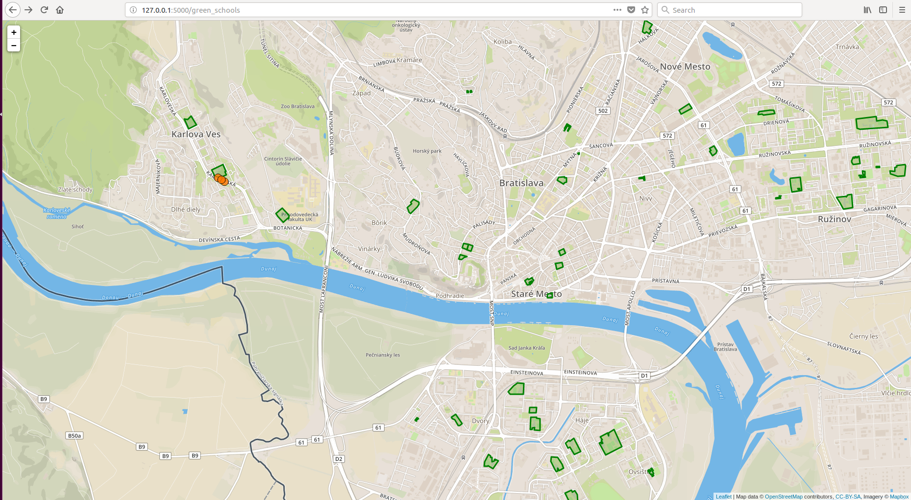

# Overview

Táto aplikácia zobrazuje školy podľa rôznych kritérií. Hlavné funkcie:
- vyhľadanie najbližšiej školy
- zobrazenie škôl v blízskosti parku alebo záhrady
- zobrazenie zastávok v blízskosti školy

Screenshot:



Aplikácia má dve časti [frontendová aplikácia](#frontend), ktorá používa leafletjs a [backendová aplikácia](#backend) napísaná v Pythone, spolu s databázou PostGIS. Frontendová aplikácia komunikuje pomocou [REST API](#api).

# Frontend

Frondendová čast je napísaná ako statické html stránky (closest_school.html, green_schools.html). Dáta z api sú zobrazovné pomocou leafletjs.

# Backend

Backend je napísaný v jazyku Python. Používa web framework Flask.

## Data

Dáta sú získané z Open Street Maps. Stiahnutá je časť Bratislavy a pomocou osm2pgsql naimportované do databázy. 

## Api

**Nájdi najbližšiu školu**

`GET /get_closest_school?lat=48.157612192119174&lng=17.04940795898438`

**Nájdi všetky školy v blízskosti parku, alebo záhrady**

`GET /get_all_green_schools`

**Nájdi zastávky v okolí**

`GET /get_close_stations?lat=48.157612192119174&lng=17.04940795898438`

### Response

API vracia geoJson s informáciou o geometrií a informácie o každej nájdenej položke:
```"{"type":"FeatureCollection",
"features":[
   {
      "id":2010890451,
      "type":"Feature",
      "geometry":{
         "type":"Point",
         "coordinates":[
            17.0516312684633,
            48.1584033956526
         ]
      },
      "properties":{
         "name":"MiÚ Karlova Ves"
      }
   }
]
}"
```